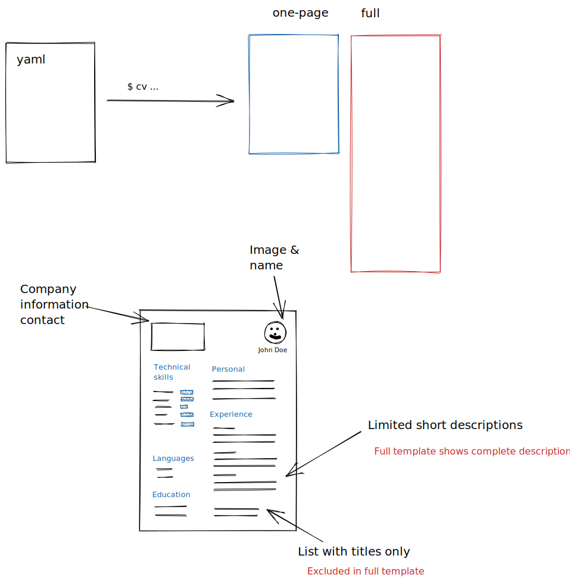

<!-- Generated by docs_test.go, DO NOT EDIT! -->cv - command for generating HTML from YAML

    $ cv -h
    
    Usage: cv [OPTIONS]
    
    Options
        -cv, --cv-input : ""
        -co, --company-file : ""
        -ms, --max-skills : 1000
        -ss, --sort-skills : "by-experience" [by-name by-experience]
        -mp, --max-projects : 1000
        -fp, --full-projects : 3
        -t, --template : "one-page" [one-page full]
        -s, --save-as : "cv.html"
        -v, --version
        -h, --help
    
    

## File formats

Two files are used to produce the final HTML, the
curriculum vitae of a person and optional company
profile. Both files are in yaml format.

### Curriculum Vitae yaml

    person:
      name: John Doe
      image: https://example.com/image.png
    
      description: John is...
    
    technicalskills:
      - item: Java
        e: 3
      - item: Javascript
        e: 3.5
      - item: Perl
        e: 5
      - item: Python
        e: 2
    
          
    languages:
      - item: Swedish
      - item: English
    
    educations:
      - subject: Computer Science
        grade: Master
        period:
          fromyear: 2000
          toyear: 2003
        location: Lund University
    
    experience:
      - title: Ship controler
        customer: Galaxy Inc
        period:
          fromyear: 2019
        tags:
          - C
          - Assembler
        roles:
          - Developer
        short: Implemented ... on hardware ...
        more: A well executed plan...
    
      - title: Space project
        customer: NASA
        period:
          fromyear: 2004
          toyear: 2019
        tags:
          - Go
          - AWS
          - Lambda
        roles:
          - Developer
        short: One sentence description
        more: more information here...
    

### Company yaml

    logo:  "https://preferit.se/Smith/uploads/2018/01/preferit-logo-1.png"
    phone: "+46 (0) 76 122 93 40"
    

